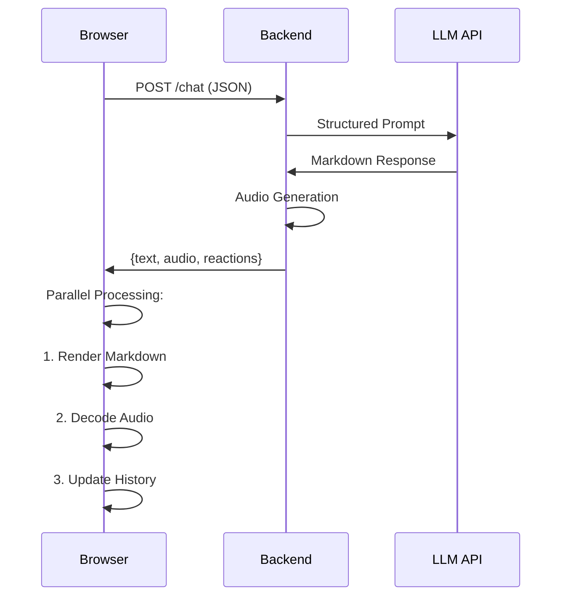

### Core System Architecture

1. **Backend (Flask)**
- REST API serving three endpoints:
  - `/chat` - Processes user messages through Groq's LLM
  - `/settings` - Handles runtime configuration updates
  - `/reaction` - Manages message reaction persistence
- Implements middleware for:
  - Audio generation (gTTS with voice modulation)
  - Conversation history management
  - Markdown preprocessing

2. **Frontend (HTML/JS)**
- Component-based UI with:
  - Real-time message rendering pipeline
  - Web Audio API integration
  - SpeechRecognition interface
- State management for:
  - Chat session persistence
  - Audio playback control
  - UI interaction states

### Key Technical Features

1. **Conversation Processing**
- Dual-phase message handling:
  ```mermaid
  graph TD
    A[User Input] --> B(Text Processing)
    B --> C{Contains Audio?}
    C -->|Yes| D[Audio Generation]
    C -->|No| E[Direct Response]
    D --> F[Base64 Encoding]
    E --> G[Markdown Parsing]
    F --> H[Response Packaging]
    G --> H
  ```

2. **Audio Subsystem**
- Modular voice pipeline:
  - Input: Web Speech API → Speech-to-Text
  - Output: gTTS → WaveSurfer.js visualization
  - Supports three voice profiles with:
    - Pitch modulation
    - Speech rate control
    - Robotic voice effects

3. **Real-time Features**
- WebSocket-less implementation using:
  - Typing indicators with CSS animations
  - Message queue with optimistic UI updates
  - Audio waveform streaming visualization

### Data Flow



### Technical Highlights

1. **Efficient Markdown Handling**
- Client-side parsing with marked.js
- CSS isolation for message content
- Syntax highlighting via dynamic CSS injection

2. **Voice Optimization**
- Audio chunking for large responses
- Base64 encoding for binary transfer
- WebWorker-based decoding

3. **State Synchronization**
- Optimistic updates for reactions
- Background history sync
- Conflict resolution for concurrent edits

### Performance Considerations

1. **Memory Management**
- LRU cache for audio clips
- Message pruning strategy
- Efficient history serialization

2. **Network Optimization**
- Gzip compression for text
- Audio streaming for long messages
- Batch updates for reactions

This architecture demonstrates a modern approach to building interactive AI applications with careful attention to:
- Real-time feedback
- Multimedia integration
- Responsive design
- State consistency
